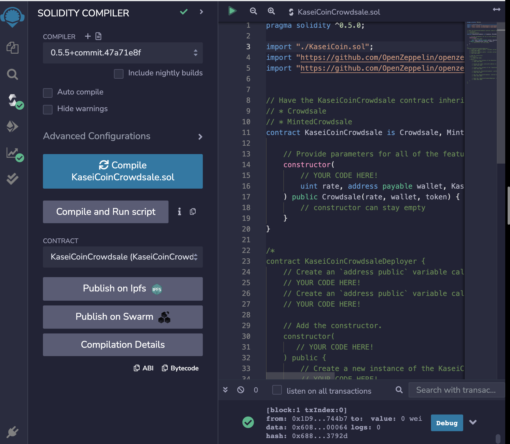

# BCPModule4

## How to deploy

The solidity contracts are all in the [contracts](./contracts) folder. 

For deployment instructions, please see this [Youtube Video](https://www.youtube.com/watch?v=EYvdUs_fzXw).

## Evaluation Evidence

